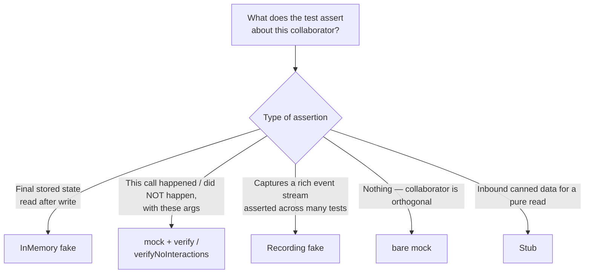

# Classical-School Java Unit Tests

Writes unit tests that maximize all four pillars (regression protection, resistance to refactoring, fast feedback, maintainability) using the Classical (Detroit) school. Targets Java 21 + JUnit 5 + AssertJ + Spring Boot projects.

## Core Decision Flow

Before writing a test, answer in order:

1. **What unit of behavior am I verifying?** (behavior, not class/method)
2. **Is the observable outcome a return value, final state, or outgoing command?**
3. **For each collaborator: is it a managed or unmanaged dependency?**

Then pick the matching shape from [Test Shapes](#test-shapes).

## The Four Pillars

| Pillar                    | Rule                                                                                                                                                                                                      |
| ------------------------- | --------------------------------------------------------------------------------------------------------------------------------------------------------------------------------------------------------- |
| Regression protection     | Exercise real domain code; domain entities and value objects are real instances.                                                                                                                          |
| Resistance to refactoring | Assert observable behavior: return values, final state, or outgoing commands to unmanaged dependencies. A failing test for unchanged external behavior is a false positive — rewrite it against observable behavior. |
| Fast feedback             | Milliseconds per test. Pure JUnit in `src/test/`; Spring context, DB, and network belong in a separate test source set.                                                                                   |
| Maintainability           | One behavior per test; minimal setup; factory methods over shared mutable state.                                                                                                                          |

## Test Doubles: The Rules

The dependency kind below anchors *production* semantics (what crosses an integration-test boundary). The *unit-test shape* — fake vs mock vs stub — falls out of what the test asserts; see the decision tree that follows.

| Dependency kind                                   | Example                                             | Production anchor                                                                                                                                                |
| ------------------------------------------------- | --------------------------------------------------- | ---------------------------------------------------------------------------------------------------------------------------------------------------------------- |
| Domain entity / value object                      | `Order`, `Product`, `Money`                         | **Real instance**                                                                                                                                                |
| In-process collaborator with only logic           | Domain service                                      | **Real instance**                                                                                                                                                |
| Managed out-of-process (app-owned DB/table)       | PostgreSQL owned by this service                    | In unit tests: **in-memory fake** when asserting persisted state, **`mock` + `verify`** when asserting interactions only; real DB in integration tests           |
| Unmanaged out-of-process (observable side effect) | SMTP, payment gateway, cross-context Kafka producer | **Mock**; verify the outgoing command                                                                                                                            |
| Pure read (incoming data)                         | Config provider, clock                              | **Stub** returning canned values                                                                                                                                 |

### Choosing the unit-test shape: what does the test assert?



The managed/unmanaged axis drives *where* the assertion happens (integration vs unit) but does not by itself force a fake. For a managed dep, a `mock` is the right choice whenever the test asserts only on interactions (e.g., "this repository was not consulted at all").

## Fakes

Write **in-memory fakes** (`HashMap`-backed repos, `List`-backed outboxes) to replace managed dependencies.

### Declaration

Declare the SUT and its collaborators as `private final` instance fields. JUnit 5's default PER_METHOD lifecycle instantiates the test class once per test method, so fields are fresh each test.

Name the SUT field after its production type in camelCase (`orderService`, `pricingCalculator`); never `sut` / `SUT`. Collaborator fields follow the same rule — name them after the production type (`orderRepository`, `tournamentRepository`), never abbreviated (`repository`, `repo`). Extract literals that repeat across the class (IDs, amounts, tokens, usernames) as `private static final` constants at the top of the test class — one source of truth, and each test reads as prose.

Never wrap a fully-wired fixture in a zero-arg `private static` factory method — promote it to a `private static final` constant so intent and identity are immediate. Keep factory methods only when they take arguments that meaningfully vary per test.

```java
// ❌ zero-arg factory — no variation to justify a method
private static Order premiumOrder() {
    return new Order(ORDER_ID, AMOUNT, CustomerTier.PREMIUM, Map.of());
}

// ✅ constant
private static final Order PREMIUM_ORDER =
    new Order(ORDER_ID, AMOUNT, CustomerTier.PREMIUM, Map.of());
```

```java
class OrderServiceTest {

    private static final OrderId ORDER_ID = OrderId.of("o-1");
    private static final Money AMOUNT = Money.of(100);

    private final OrderRepository orderRepository = new InMemoryOrderRepository();
    private final OrderService orderService = new OrderService(orderRepository);

    @Test
    void shouldMarkOrderPaidWhenPaymentSucceeds() {
        // given
        var order = new Order(ORDER_ID, AMOUNT);
        orderRepository.save(order);

        // when
        orderService.markPaid(ORDER_ID);

        // then
        assertThat(orderRepository.findById(ORDER_ID).orElseThrow().status())
            .isEqualTo(OrderStatus.PAID);
    }

    private static final class InMemoryOrderRepository implements OrderRepository {
        private final Map<OrderId, Order> store = new HashMap<>();
        @Override public void save(Order o) { store.put(o.id(), o); }
        @Override public Optional<Order> findById(OrderId id) { return Optional.ofNullable(store.get(id)); }
    }
}
```

When dependency configuration varies per test (e.g., a different `Clock`), use a private factory method that returns a freshly-wired SUT for that test.

### Scope

- Used in one test class → `private static` nested class in that file.
- Reused across ≥2 test classes → promote to `src/testFixtures/` (or the project's shared test source set).

### Role, shape, and Lombok — one table

A collaborator's sophistication must match what the test asserts. Pick the role first; shape follows from whether the double holds mutable state.

| Role             | Use when the test asserts…                                                              | Shape                                                                                         | Lombok                                              |
| ---------------- | --------------------------------------------------------------------------------------- | --------------------------------------------------------------------------------------------- | --------------------------------------------------- |
| Bare `mock(...)` | Nothing on this collaborator, **or** only "was/wasn't called with X" via `verify`       | —                                                                                             | —                                                   |
| `StubXxx`        | Inbound canned values (`Clock`, config, role selector)                                  | `record` by default; `class` with `@Setter` when ≥2 tests reconfigure a shared field instance | `@Setter` only on the reconfigurable-class variant  |
| `InMemoryXxx`    | **Final state** the SUT wrote (read back through the port's public API)                 | `class`                                                                                       | `@RequiredArgsConstructor` if it has collaborators  |
| `RecordingXxx`   | A **sequence of rich events** introspected across multiple tests (outbox-style)         | `class`                                                                                       | `@Getter` on the captured `List`/`Map`              |

The rule underneath the table: **`record` unless the double holds mutable state** (`Map`/`List` store, `@Setter` config field, `@Getter`-exposed capture).

A bare `mock(...)` is appropriate in two cases: (1) the collaborator is orthogonal to the test (logging, MDC, tracing, metrics counters the test doesn't assert on), or (2) the *only* assertion on it is via `verify(...)` / `verifyNoInteractions(...)`. Declare it as a class-level `private final` field, never inline. The moment you need to read back persisted data, switch to an `InMemoryXxx`. The moment you need a canned return value reused across tests, switch to a `StubXxx`. The moment you need to introspect a rich captured event across several tests, switch to a `RecordingXxx`.

### When to reach for `RecordingXxx`

Reach for `RecordingXxx` only when **all** of the following hold:

1. The captured value is a rich object whose fields are asserted across ≥2 tests in the file, **and**
2. The collaborator's port has more than one method to track, **or** the captured stream's order/multiplicity is itself the behavior under test, **and**
3. `verify(mock, times(n)).method(argThat(...))` would obscure the assertion.

If only condition 1 holds, prefer `verify(mock).method(argThat(...))`. A single-method port whose only assertion is "was/wasn't called" never warrants a `RecordingXxx` — use a field-level `mock(...)` with `verifyNoInteractions(...)` or `verify(...)`.

When some tests assert on a collaborator and others don't, keep a bare `mock(...)` as the default field and reach for `verify(...)` / `verifyNoInteractions(...)` in the specific tests that care. Promote to `RecordingXxx` only under the three-condition gate above.

A hand-written `NoopXxx` is rarely needed — reach for one only when Mockito can't mock the type (e.g., a `final` class you don't own).

### Lambda stubs for SAM ports

When the port is a `@FunctionalInterface` (or a single-abstract-method interface) and only one test needs a canned value, a lambda is the lightest legal stub:

```java
OrderRepository emptyRepo = id -> Optional.empty();
```

Use a named `StubXxx record` once two or more tests want the same canned response, or once the port has ≥2 methods.

### Examples

```java
private record StubClock(Instant fixed, ZoneId zone) implements Clock {
    @Override public Instant instant()        { return fixed; }
    @Override public ZoneId getZone()         { return zone; }
    @Override public Clock withZone(ZoneId z) { return new StubClock(fixed, z); }
}

private record StubTaxCalculator(Country supportedCountry) implements TaxCalculator {
    @Override public Money computeTax(Money amount) {
        return amount.multiply(new BigDecimal("0.20"));
    }
    @Override public Country getSupportedCountry() {
        return supportedCountry;
    }
}

private static final class InMemoryOrderRepository implements OrderRepository {
    private final Map<OrderId, Order> store = new HashMap<>();
    @Override public void save(Order o)                   { store.put(o.id(), o); }
    @Override public Optional<Order> findById(OrderId id) { return Optional.ofNullable(store.get(id)); }
}

private static final class RecordingAuditLog implements AuditLog {
    @Getter private final List<AuditEntry> entries = new ArrayList<>();
    @Override public void append(AuditEntry entry) { entries.add(entry); }
}

private static final class StubPricingPolicy implements PricingPolicy {
    @Setter private Money configured;
    @Override public Money priceFor(Product product) { return configured; }
}
```

Implement colliding accessors explicitly when a port's method name clashes with a record component (`getSupportedCountry()` above). Test-only value types referenced by these doubles should also be records.

### Fakes represent working collaborators

A fake records calls, serves canned reads, or mutates an in-memory store. Failure modes live outside the fake: no `willThrow(...)` method, no `nextError` field, no `throw` branch in an overridden port method.

To test how the SUT reacts to a dependency failure, construct a Mockito mock **inline inside that one test**, wire it into a locally-constructed SUT, and keep every other collaborator pointing at its shared field-level fake. Assert on the observable outcome — thrown exception, rolled-back state, or emitted failure event. When the SUT swallows the failure, assert on the recorded side effect via a `RecordingXxx` fake instead.

```java
class OrderServiceTest {

    private static final OrderId ORDER_ID = OrderId.of("o-1");
    private static final Money AMOUNT = Money.of(100);

    private final OrderRepository orderRepository = new InMemoryOrderRepository();
    private final NotificationGateway notificationGateway = mock(NotificationGateway.class);
    private final OrderService orderService = new OrderService(orderRepository, notificationGateway);

    @Test
    void shouldWrapRepositoryFailureAsDomainException() {
        // given
        var throwingRepository = mock(OrderRepository.class);
        when(throwingRepository.save(any())).thenThrow(new DataAccessException("boom"));
        var orderService = new OrderService(throwingRepository, notificationGateway);
        var order = new Order(ORDER_ID, AMOUNT);

        // when then
        assertThatThrownBy(() -> orderService.place(order))
            .isInstanceOf(OrderPlacementFailedException.class)
            .hasMessageContaining(ORDER_ID.value());
    }
}
```

If you reach for the inline-mock pattern in a second test to feed canned data (rather than simulate a failure), build a `StubXxx` with `@Setter` instead.

## Mocks: Verifying Interactions

Use Mockito to verify outgoing commands to unmanaged side effects (emails, external APIs, cross-boundary Kafka, webhooks) **and** to assert *interactions only* against a managed port (e.g., "this repository was not consulted").

```java
// then — outbound command to an unmanaged side effect
verify(emailGateway).send(argThat(e -> e.to().equals("a@b.com")));
verifyNoMoreInteractions(emailGateway);
```

```java
// then — managed port should not have been touched at all
verifyNoInteractions(tournamentRepository);
```

For managed dependencies, when the test asserts on **what was persisted**, read final state through an `InMemoryXxx` fake's public API instead of verifying calls. Pure read stubs provide inbound data and are read from, not verified.

### Worked example: "did not consult this port"

A test that wants to assert "the SUT didn't touch the tournament repository for this branch" needs nothing more than a field-level `mock(...)` and `verifyNoInteractions(...)`. Do **not** invent a `RecordingXxx` for this — it fails the three-condition gate.

```java
class GolfStateProcessorMatchplayTest {

    private final InMemoryStateEventRepository repository = new InMemoryStateEventRepository();
    private final GolfTournamentRepository tournamentRepository = mock(GolfTournamentRepository.class);
    private final GolfStateProcessor processor = new GolfStateProcessor(repository, tournamentRepository);

    @Test
    void matchplayRoundStartedUsesMatchStateKeyWithoutTournamentLookup() {
        // given
        var unpacked = matchplayStarted(MATCHPLAY_SPORT_EVENT_ID, COMPETITOR_ID, 3);

        // when
        var essence = processor.apply(unpacked);

        // then
        assertThatEssence(essence)
            .withCurrentRoundNumber(3)
            .withSportEventStatus(GolfSportEventStatus.IN_PROGRESS);
        verifyNoInteractions(tournamentRepository);
        assertThat(repository.findSnapshot(MATCHPLAY_STATE_KEY, GolfMatchStateEssence.class)).isPresent();
    }
}
```

### Forbidden: `ArgumentCaptor`

`ArgumentCaptor` splits one assertion across two timeframes (capture during `verify`, assert later). It is always replaceable, and the replacement reads top-to-bottom:

- Scalar arguments: `verify(gateway).charge(eq(TOKEN), eq(AMOUNT));`
- Compound argument with one or two fields: `verify(gateway).send(argThat(e -> e.to().equals("a@b.com")));`
- Compound argument with many fields, or repeated capture across the test class: switch the collaborator to a `RecordingXxx` (under the three-condition gate) and use AssertJ on the captured list.

## Lombok (stateful classes only; never on records or tests)

- `@RequiredArgsConstructor` — any class with `private final` collaborators (including stateful fakes).
- `@Slf4j` — logging.
- `@Getter` — on a `RecordingXxx` fake's captured `List`/`Map`.
- `@Setter` — on a reconfigurable `StubXxx` fake's scripted-value field.
- `@Value` only when `record` won't do; `@Builder` for ≥4 args.
- Forbidden: `@Data`, `@AllArgsConstructor` / `@NoArgsConstructor` on domain types, any Lombok on test methods or on records.

## Structural Rules

### Strict Given / When / Then

```java
@Test
void shouldRejectNegativeDeposit() {
    // given
    var account = Account.opened(Money.zero());

    // when then
    assertThatThrownBy(() -> account.deposit(Money.of(-1)))
        .isInstanceOf(IllegalArgumentException.class)
        .hasMessageContaining("positive");
}
```

- Exactly **one** method invocation in `// when`. When two feel necessary, redesign the SUT for cohesion.
- Omit `// given` when there is zero setup.
- Exception-path tests use a single `// when then` block and pass the lambda directly to `assertThatThrownBy(...)`.
- Zero branching in test bodies: use `@ParameterizedTest` + `@CsvSource` for variation.

### Test method naming

`shouldXxxWhenYyy`, or a plain English sentence describing observable behavior. Field-naming rules live in [Declaration](#declaration).

## Test Shapes

Pick one shape per test.

### 1. Output-Based (preferred — mathematical function)

Pure input → pure output. Maximizes all four pillars.

```java
@Test
void shouldComputeDiscountedPriceForPremiumCustomer() {
    var result = PricingCalculator.compute(Money.of(100), CustomerTier.PREMIUM);
    assertThat(result).isEqualTo(Money.of(80));
}
```

When production code isn't pure enough for this shape, extract the logic into a pure function (Functional Core, Imperative Shell) before writing the test.

### 2. State-Based

The SUT mutates a real collaborator; assert against final observable state, read through the same public API production code uses.

```java
// then
assertThat(orders.findById(id).orElseThrow().status()).isEqualTo(PAID);
```

### 3. Communication-Based (rare — unmanaged commands, or "did/didn't call" on a managed port)

```java
// then — outgoing command to an unmanaged side effect
verify(paymentGateway).charge(eq(CardToken.of("tok")), eq(Money.of(100)));
verifyNoMoreInteractions(paymentGateway);
```

```java
// then — managed port, interaction-only assertion
verifyNoInteractions(tournamentRepository);
```

## Assertions (AssertJ)

- Use `assertThat(...)` exclusively. For exceptions: `assertThatThrownBy(...)` or `assertThatExceptionOfType(...)`.
- DTOs, records, value objects, maps, unordered collections: `assertThat(actual).usingRecursiveComparison().isEqualTo(expected);`.
- One logical assertion per test. Multiple `assertThat` lines are fine when they describe one behavior.

## Humble Object / Architectural Alignment

When a SUT is hard to unit-test, refactor the architecture before adding mocks:

- Pull I/O, framework glue, or Kafka plumbing into a thin "humble" adapter.
- Move the wrapped logic into a pure domain class.
- Unit-test the domain class output-based; cover the humble adapter with one integration test.

Signals the architecture needs this refactor:

- A single test would need more than two mocks.
- A mocked method's signature would change under a non-behavioral refactor.
- The test wants to reach into private state or `spy()` on the SUT.

## Parameterized Tests

`@ParameterizedTest` + `@CsvSource` collapses near-duplicate tests.

```java
@ParameterizedTest
@CsvSource(textBlock = """
    REGULAR, 100, 100
    SILVER,  100,  95
    GOLD,    100,  90
    PREMIUM, 100,  80
""")
void shouldApplyTierDiscount(CustomerTier tier, int gross, int expected) {
    assertThat(PricingCalculator.compute(Money.of(gross), tier))
        .isEqualTo(Money.of(expected));
}
```

Use `@MethodSource` only when inputs can't be expressed as simple scalars.

## Spring Boot Specifics

- `src/test/` holds pure unit tests. Slice tests and Spring context tests belong in `src/componentTest/` or `src/integrationTest/`.
- Reset state with explicit `@BeforeEach` / `@AfterEach`.
- For time, inject `java.time.Clock` and use `Clock.fixed(...)` in tests.

## Pre-Commit Checklist

- [ ] Exactly one `// when` action; test body is branch-free.
- [ ] Real domain objects; managed-dep state via in-memory fakes; mocks (or `verifyNoInteractions`) for unmanaged side effects and interaction-only assertions on managed ports.
- [ ] Shape matches the mutable-state rule: `record` unless the double holds state.
- [ ] Every collaborator is as minimal as the assertions require.
- [ ] Fixtures built once: no zero-arg test factory methods — use `private static final` constants instead.
- [ ] No scripted failures inside a fake — exception paths use an inline `mock()` in that one test.
- [ ] No `ArgumentCaptor` — use `eq(...)` / `argThat(...)` inline, or a `RecordingXxx` fake (under the three-condition gate) for repeated rich-object capture.
- [ ] No nested `RecordingXxx` for what is fundamentally a `verify(mock).method(...)` or `verifyNoInteractions(mock)` assertion.
- [ ] AssertJ only; test name describes observable behavior.
- [ ] Test still passes when production code is refactored without changing behavior.
